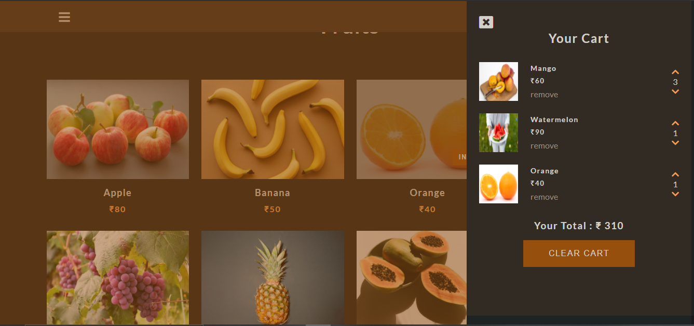

## Shoping Cart




# Project Title

Responsive Fruit Store

## 1. Demo Website

- 👉 Netlify : https://anushkashopingcart.netlify.app/

## 2. You Will Learn

```
- HTML5 and CSS3: Semantic Elements, CSS Grid, JavaScript.

-  Add to Cart, Remove Product , Increse Product ,
   Decrese Product.

- Save Cart Products in Local Storage.
```

## 3. Clone repo

```
$ git@github.com:NileshShriwas/Shoping-Cart.git
$ cd Shoping-Cart
```

## 4. Run

```
- Run this on chrome: http://192.168.142.77:5500/index.html

- You are use VS Code install Live Server (Extention) and Directly Run.
```
